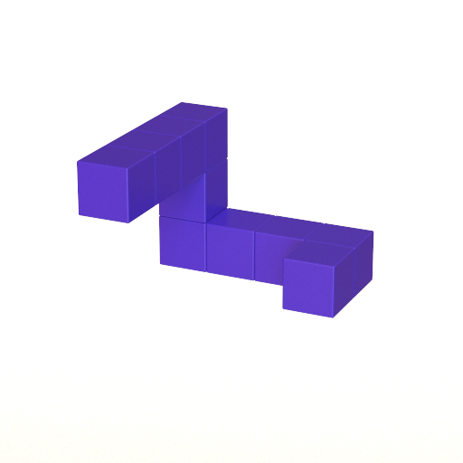

# Stimuli from Shepard & Metzler (1971)

This repository contains a collection of scripts for generating and rendering stimuli similar to those from Shepard & Metzler (1971).



## Dependencies

Running these scripts requires [Blender](https://www.blender.org/) for generating the meshes and [Mitsuba](https://www.mitsuba-renderer.org/) for rendering the images. You will also need Python 3 with a few libraries which you can install with:

```
pip3 install -r requirements.txt
```

## Generating meshes

To generate the meshes, you must run Blender with the `generate_meshes.py` script, which you can do by running:

```
make meshes
```

This will save out meshes into the `stimuli/mesh` folder. You can change which meshes are created by modifying the list at the beginning of `generate_meshes.py`. This list contains stimulus ids that determine what the mesh will actually look like. For example, "x_3_y_2_z_-3_x_2" means "add three blocks along the x-axis", then "add two blocks in the y-direction", then "add three blocks in the negative z-direction", and finally "add two blocks in the x-direction". For each stimulus id provided, there will actually be two meshes created: one which is the original mesh (prefixed with 'A') and one in which the mesh is reflected across the y-axis (prefixed with 'B'). Using this syntax you can create any block stimulus that you want.

After generating the meshes, you can look at an example of one in Blender with:

```
make preview_mesh
```

To change which one is previewed, you'll need to modify the `stim_id` variable at the bottom of `preview_mesh.py`.

## Rendering scenes

To render the meshes created using Blender, you first need to generate XML "scene" files for Mitsuba that specify the camera position, lighting, materials, etc. To create the scenes, run:

```
make scenes
```

This will create one folder for each mesh in `stimuli/scene` with the same name as the mesh, and then within each of those directories will be a set of scene files corresponding to different rotations of the stimulus. The rotations correspond to rotations around the upward axis (this is the y-axis in Mitsuba) of 20-degree increments, for each of the following x-axis and z-axis rotations: (0, 0), (0, 90), (0, 180), (0, 270), (90, 0), and (270, 0). These rotations correspond essentially to rotating the shape so that a different side is facing down each time.

If you want to generate different rotations, you'll need to edit the `generate_scenes.py` file. If you want to change something about all scenes (e.g. the camera position or lighting), you'll need to edit the template scene file `resources/scene.xml.j2`.

Once the scenes have been generated, you can preview what one of them looks like by running:

```
make preview_scenes
```

You can modify the Makefile if you want to preview a different scene.

Finally, to actually render the images, run:

```
make render
```

Note that this can take a very long time (on average, about 2.5 minutes per image on a 8-core processor, which is about 6 days total for all the images).
